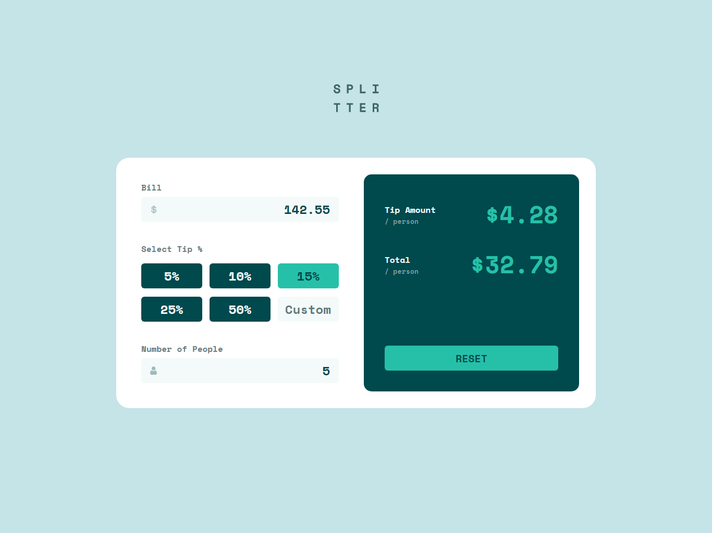
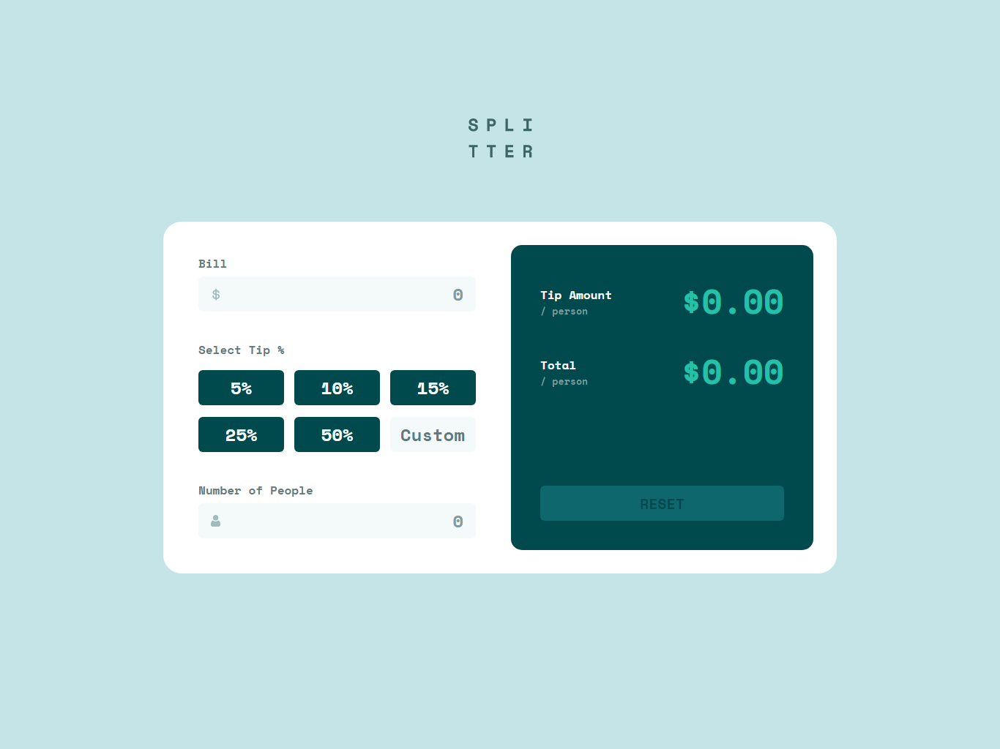
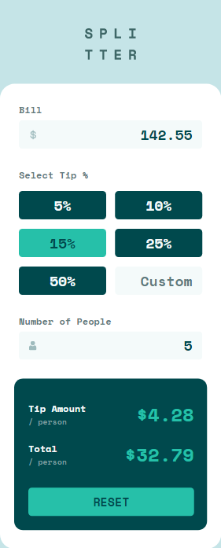
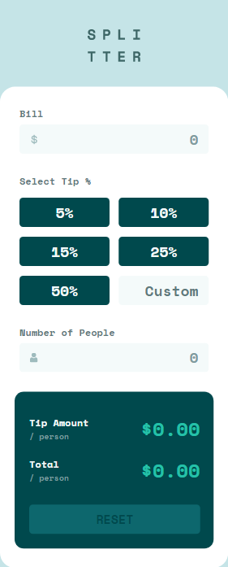

# Frontend Mentor - Tip calculator app solution

This is a solution to the [Tip calculator app challenge on Frontend Mentor](https://www.frontendmentor.io/challenges/tip-calculator-app-ugJNGbJUX). Frontend Mentor challenges help you improve your coding skills by building realistic projects. 

## Table of contents

- [Overview](#overview)
  - [The challenge](#the-challenge)
  - [Screenshot](#screenshot)
  - [Links](#links)
- [My process](#my-process)
  - [Built with](#built-with)
  - [What I learned](#what-i-learned)
  - [Continued development](#continued-development)
  - [Useful resources](#useful-resources)
- [Author](#author)
- [Acknowledgments](#acknowledgments)

## Overview
In search for resources to better my front-end Journey, I discovered an amazing site that provides front-end developers with design files to replicate. I signed in with my Github account to get access to this challange. Well, here I am.

### The challenge

Users should be able to:

- View the optimal layout for the app depending on their device's screen size
- See hover states for all interactive elements on the page
- Calculate the correct tip and total cost of the bill per person

### Screenshot

### Links

- Solution URL: [Tip Calculator](https://www.frontendmentor.io/solutions/responsive-tip-calculator-designed-with-pure-html-css-and-javascript-eC8NdLaDFD)
- Live Site URL: [Tip Calculator](https://source-web.github.io/tip-calculator/)

## My process

- The project details and files were gotten from [Front-end Mentor](https://www.frontendmentor.io)
- I read the README file before starting the project, there I got directives on how to work out the challange.
- Afterwards, I wrote the HTML first then created a separate style sheet for my CSS.
- I used Figma to get the best judgement for margins, paddings and width.
- The Desktop View was styled first, then I used CSS media query to make it responsive.

### Built with

- Semantic HTML5 markup
- CSS custom properties
- Flexbox
- CSS Grid
- JavaScript
- JavaScript Functions
- JavaScript DOM

### What I learned

From this project, I've been able to learn the approach to reproducing a UI/UX design and how to better handle a project.

### Continued development

In future projects, I want to be able to combine my HTML and CSS knowledge with JavaScript to be able to build a flexible, responsive, functional and interactive websites, landing pages, blogs and a Portfolio for myself.

### Useful resources

- [Figma.com](https://figma.com) - This helped me to get the best judgement for font-size, margin, padding, width and border-radius. I really liked this pattern and will use it going forward.

## Author

- Github - [Nwali Joseph](https://github.com/Source-Web)
- Frontend Mentor - [@Source-Web](https://www.frontendmentor.io/profile/Source-Web)
- Facebook - [@joseph.nwali.5249](https://www.facebook.com/joseph.nwali.5249)

## Acknowledgments

I want to thank front-end Mentor for this design challenge. My front-end journey has been a smooth one with you.

I also appreciate Github pages for allowing me host this challange for free.
